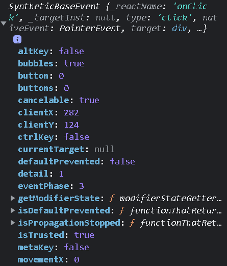
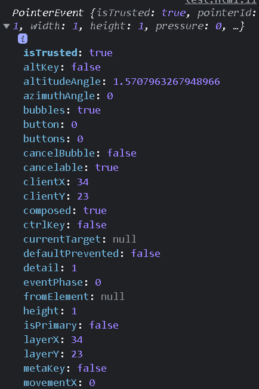
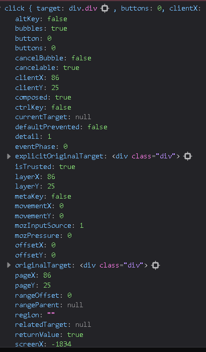

# 리액트(React) Q&A

### 훅(hook) 관련 Q&A
- [여기 링크](./hook.md)를 참조하시오

### css 패턴관련 Q&A
- [여기 링크](./css_패턴.md)를 참조하시오

### 리액트 18 관련 Q&A
- [여기 링크](./react_18.md)를 참조하시오

### 테스트 주도 개발(TDD) 관련 Q&A

- [여기 링크](./TDD.md)를 참조하시오


### 상태관리 관련 Q&A

- [여기 링크](./state_management.md)를 참조하시오


###  Q. 리액트가 무엇인가?

우리는 뮤테이션을 최소화하기를 원한다.
우리는 개념적인 단순함을 주는 무언가를 만들고 싶다.
(we want to minimize the amount of mutation
we want to build something that gives us the conceptual simplicity)\
\
-- 조던월크 (Jordan Walke, 리액트 창시자)
\
복잡성을 제어하는 것이 컴퓨터 프로그래밍의 본질이다\
-- 브라이언 커니핸 (Brian Wilson Kernighan)\
\
그리고 이것이 우리가 하려는 일이다\
-- Jim Sproch (ex-React Core Team)\
\
이것이 리액트이다\
즉 리액트는 변이를 최소화하고 복잡성을 제거하기 위해 태어난 UI 라이브러리 이다

### Q. 리액트는 어떻게 변이를 최소화하고 복잡성을 제거하는가 ?

A. 리액트는 훅이라는 도구를 이용해서 변이를 최소화한다.\
또한 컴포넌트라는 단위로 UI엘리먼트를 작성하는 방식으로 복잡성을 줄인다

### Q. 훅이 어떤 방식으로 처리되길래 변이가 최소화되는가 ?

A. 훅에서 관리하는 변수는 개발자가 직접적으로 접근할 수 없다. 즉 리액트 엔진 내부에서만 접근이 가능하다.\
이게 무슨 말일까? useState의 예를 들어보자

```javascript
const [number, setNumber] = useState(1)
```

위와 같은 코드에서 우리는 number라는 값에 접근할 수 있다. 그런데 이 값은 리액트가 직접적으로 관리하는 값을 복사한 값이다. 따라서 개발자가 number 변수를 아무리 조작하더라도 실제 리액트에서 관리하는 number값에는 영향을 미치지 않는다\
`setNumber`함수는 리액트에서 관리하는 number에 접근하기 위한 인터페이스이다. 이 인터페이스는 값을 조작할 때 메모리 영역에 값을 오버라이트 하지 않는다. 리액트 엔진은 자체적으로 변이를 최소화하는 방식으로 변수를 관리하는데 이것은 변수를 임뮤터블로 관리하기 때문이다. 즉 같은 메모리 공간에 값을 재할당하는 일이 없다

---

##  리액트 펀더멘탈 관련

### Q. 증분 렌더링(incremental rendering)이란 무엇인가?

증분 렌더링은 유저에게 높은 프레임 레이트 기반으로 부드럽게 변화하는 화면을 보여주기 위해 고안된 렌더링 기법이다\
\
무거운 렌더링 작업을 수행할 때 이 렌더링 작업을 도중에 중단없이 한번에 수행한다고 가정해보자\
\
이 때 리액트가 사용하는 자바스크립트 엔진은 렌더 스레드를 장시간 선점한다. 이 시간동안 렌더 스레드에서 수행될 수 있는 다른 모든 작업들은 일시중지된다.\
\
가령 유저의 입력을 받아서 처리하는 작업 또는 돔을 갱신하거나 렌더링을 요청하는 작업 등은 모두 일시중지 되는것이다.\
\
만일 자바스크립트를 실행하는 시간이 일정 시간을 초과하면 유저 입장에서는 마치 웹페이지가 프리징 된 것 같은 느낌을 준다.\
\
이는 유저 입장에서는 불쾌한 개념이며 사이트 이용의 만족도를 떨어뜨린다. 이처럼 뚝뚝 끊기는 화면으로 의한 불쾌한 사용자 경험을 감소시키려면 자바스크립트 코드가 렌더러 스레드를 선점하는 시간을 일정시간 이하로 낮추는 작업이 필요하다.\
\
리액트에서는 이것을 증분 렌더링이라는 개념으로 어느정도 극복했다. 증분 렌더링은 무거운 렌더링 작업을 수행할 때 수행되는 시간이 일정시간 초과된다면 수행한 지점까지의 정보는 환경변수에 기록한 뒤에 일단 렌더링을 수행하고 다음 렌더링 사이클이 오면 이전에 중단되었던 환경변수에 저장된 값을 기반으로 렌더링 프로세스를 재개하는 렌더링 메커니즘을 일컫는다

### Q. 함수형 컴포넌트에는 라이프사이클 개념이 없는가 ?

함수형 컴포넌트도 클래스 컴포넌트와 똑같은 라이프사이클을 사용한다\
\
클래스 컴포넌트에서는 이 라이프 사이클 이름을 기반으로 메소드 이름이 네이밍되었지만 함수형 컴포넌트에서는 직접적으로 라이프사이클 이름이 포함된 함수를 호출하지는 않는다.\
\
하지만 그게 함수형 컴포넌트에서는 라이프사이클 개념이 없다는 뜻은 아니다.\
\
라이프사이클에는 크게 아래의 6가지가 있다. 각 라이프사이클에 따라서 실행되는 함수가 다르다.\

```
componentWillMount : 컴포넌트가 마운트되기 직전에 발생한다
componentDidMount  : 컴포넌트가 마운트된 직후에 발생한다
componentWillUpdate :  컴포넌트가 업데이트되기 직전에 발생한다
componentDidUpdate :  :  컴포넌트가 업데이트된 직후에 발생한다
componentWillUnmount :  컴포넌트가 언마운트되기 직전에 발생한다
componentDidUnmount :  컴포넌트가 언마운트된 직후에 발생한다
```

### Q. 리컨사일(reconcile)이란 무엇인가 ?

A. 리컨사일은 두가지 가상돔을 비교하여 변화된 엘리먼트를 탐지하는 메커니즘이다\

여기서 비교되는 2가지 가상돔은 각각 Current DOM이고 두번째는 Work-In-Progress DOM이다.
`ReactDOM.render()`를 수행했을 때 최초의 실행이 아니라면 리컨사일레이션이 수행된다. 그 과정은 아래와 같다\
`ReactDOM.render()`의 인자인 루트 컴포넌트가 호출된다. 루트 컴포넌트 함수가 호출되면 나머지 자식함수는 줄줄이 재귀호출된다. 그리고 리액트 화이버를 리턴할 텐데 이 리액트 화이바들은 전부 트리구조로 연결되어 있다. 그 최종적으로 그 트리구조가 `ReactDOM.render()`의 첫번째 인자가 된다\
그러면 `ReactDOM.render`는 이미 하나의 가상돔을 확보한 셈이 되는 것이고 이를 가상돔 최상위노드인 current 노드의 자식으로 링킹한다. 이것으로 current DOM이 완성된다\
\
이후 current DOM을 Work-In-Progress DOM에 카피한다. 이렇게 하여 잠정적으로 2개의 가상돔이 준비된다\
\
그 후 훅을 호출하는 과정에서 이펙트리스트(effectList)에 저장된 변경사항을 Work-In-Progress DOM에 반영한다\
\
마지막으로 current DOM과 Work-In-Progress DOM을 diff알고리즘으로 비교하여 서로간의 불일치되는 html 엘리먼트를 검색한다\
\
불일치되는 html 엘리먼트를 마크한다. 여기까지의 과정은 증분 렌더링(incremental rendering) 방식으로 수행된다\
\
반면 고전적인 리컨사일레이션 모델에서는 이러한 diff알고리즘이 재귀에 기초하였다 (recursively compares subsequent invocations).
\
모든 업데이트된 html엘리먼트의 탐색이 종료되면 마크된 html 엘리먼트만을 골라서 재랜더링한다\
\
재랜더링이 완료되면 하나의 렌더링 사이클이 종료된다

### Q. 리액트 화이버란 무엇인가 ?

A. 리액트 화이버란 다음의 두가지를 일컫는다\
\
첫째로 리액트 화이버란 새로운 리컨사일 알고리즘이다\
\
리액트 화이버는 버추얼 스택 프레임 알고리즘으로 구현되었다\
\
스택프레임 방식대로 FIFO방식으로 트리 탐색을 수행하는 것으로 보인다\
\
즉 마지막 리프 노드부터 변경대상을 순서대로 저장해 변경된 엘리먼트를 모아놓는 이펙트리스트(effectList)라는 자료구조에 푸시(push)된다. 이펙트 리스트는 링크드 리스트인데 각각의 원소는 리액트 화이버이다\
\
마지막으로 리액트 화이버는 새로운 종류의 리액트 엘리먼트를 가리킨다\
\
A. 또 다른 답변. 리액트 화이버는 일종의 스택 프레임으로 볼 수 있다.\
가상 스택의 각 프레임에는 리액트 화이버가 프레임을 차지한다\
가상 스택은 일반적인 스택과 같다. 다만 팝(POP)의 실행시기를 지정할 수 있다.\
다시 말해 가상 스택은 서스펜드(suspend)와 재개(resume) 명령어를 지원한다\
이는 제네레이터를 연상케 한다\
\
가상 스택 프레임을 도입한 이유는 전체 리렌더링 테스크를 여러 트랜잭션으로 나누어 프레임 단위로 UI 업데이트를 컨트롤 해야하기 때문이다\
\
리액트 화이버에서는 트랜잭션에 우선순위를 부여할 수 있다\
\
리액트 내부에서 12.3ms를 하나의 프레임 주기로 간주하고 작업의 재개와 중단을 수행하는 주체는 workLoop 함수이다.\
이 함수는 루프를 돌며 마감시간이 다가올 때 까지 반복한다

---

## 리액트 컴포넌트 관련

### Q. 렌더리스 컴포넌트(Renderless Component)란 무엇인가?

렌더리스 컴포넌트는 말 그대로 어떤것도 화면상에 렌더링하지 않는 컴포넌트이다\
\
렌더리스 컴포넌트는 오직 이벤트 리스너의 목적으로 사용된다. 그리고 특히 전역 이벤트를 탐지하는 용도로 쓰인다\
\
유저가 스크롤하는 이벤트를 탐지하거나 웹브라우저가 리사이징되는 이벤트를 탐지하는 기능이 렌더리스 컴포넌트가 사용되는 대표적인 예이다

### Q. 프래그먼트 (Fragment) 엘리먼트가 무엇인가?

프래그먼트는 아무런 내용이 없는 빈 엘리먼트이다\
\
하나의 함수 컴포넌트는 하나의 루트 엘리먼트를 반환해야 한다. 그래서 div등을 루트 엘리먼트로 활용해서 다른 엘리먼트를 랩핑하는 패턴을 활용했는데 프래그먼트 컴포넌트를 사용하면 보다 깔끔하게 코드를 표현할 수 있다\
\
프래그먼트 컴포넌트는 html상에 표현되는 컴포넌트가 아니며 리액트에서 루트 엘리먼트를 표기하기 위한 용도로만 사용된다\
\
프래그먼트 컴포넌트는 IDE상에서 함수 컴포넌트의 리턴문으로 이동하기 위한 트릭으로도 사용할 수 있다\
\
VS Code에서 Ctrl+F를 누르고 `<>`라고 입력하면 프래그먼트 엘리먼트로 이동하는데 이러한 테크닉은 상황에 따라서 유용하게 사용할 수 있다
\
[공식링크](https://ko.reactjs.org/docs/fragments.html)

### Q. 프로파일러 (profiler) 컴포넌트가 무엇인가 ?

프로파일러 컴포넌트는 일종의 랩퍼 컴포넌트인데 이는 자식 컴포넌트의 렌더링 코스트를 계산한다\
즉 성능 최적화 작업에 프로파일러 컴포넌트를 사용할 수 있다\
\
프로파일러 컴포넌트는 `<Profiler></Profiler>`와 같이 기입해서 사용한다. 구체적인 예시는 아래와 같다

```javascript
  <Profiler id="nav" onRender={callback}>
    <Navigation {...props} />
  </Profiler>

```

### Q. 리액트 블럭 (React.block)이 무엇인가 ?

A. 잠깐 거론되다가 정식으로 채택된 개념은 아닌것으로 보인다.\
https://github.com/facebook/react/issues/17413/ 이 링크에서 잠깐 등장한다

---

## 기타

### Q. 함수형 컴포넌트와 클래스 컴포넌트의 렌더링 메커니즘은 다른가 ?

A. 댄(Dan Abramov)은 함수형 컴포넌트의 리랜더링 메커니즘이 클래스 컴포넌트의 그것과 동일하다고 답변했습니다.\
`they literally use the same code.`

### Q. 컴포넌트가 리랜더링 되는 조건이 구체적으로 어떻게 되는가 ?

A. props나 상태의 변화가 감지되면 렌더링이 트리거 된다고는 하지만 사실은 그렇지 않다. props나 상태의 변화는 함수 컴포넌트를 다시 호출할 뿐이며 함수를 다시 호출하는 것이 재랜더링으로 이루어지지는 않는다. 사실 상태가 바뀌던 말던 궁극적으로 함수 컴포넌트가 리턴하는 리액트 엘리먼트 (React Element)의 값이 기존의 값과 다를 때 리컨사일러가 리렌더링을 수행한다

### Q. 컴포넌트에 여러개의 옵션을 주어서 미세하게 다르게 렌더링하게 만들고 싶다. 이런경우 props가 10개가 넘어간다. 이걸 일일이 인자로 넘겨줘야 하는 상황은 너무 번거롭다. 더 간편하게 할 수 있는 방법이 있는가 ?

A. props에 디폴트 값을 주고 변경하고 싶은 인자만 넘겨주면 되는일이다. 이 디폴트 파라메터 기능은 ES6부터 적용되었다

### Q. 리액트 컴포넌트에 key 어트리뷰트는 왜 기입하는가?

A. key 어트리뷰트의 사용이 의무는 아니다. key를 기입하지 않더라도 정상적으로 렌더링은 수행된다. 하지만 key를 기입하면 보다 효율적인 방식으로 리컨사일러가 작동한다. 효율적인 방식으로 리컨사일러가 작동하여 얻는 이득은 빠른 렌더링이다. 결론적으로 key 어트리뷰트를 사용하면 렌더링시에 속도상의 이점이 있을 수 있다\
key는 같은 형질의 엘리먼트가 나열될 때 리컨사일러가 순서를 기억하기 위한 목적으로 사용된다. 예를 들어 div 엘리먼트가 나란히 3개 있을 때 이들 각각을 a,b,c라 하자. key가 부여되지 않은 상태에서 이들 a,b,c 엘리먼트의 순서를 b,c,a로 바꾼다면 리컨사일러는 기존에 존재했던 엘리먼트를 모두 삭제한 뒤에 엘리먼트를 새로 생성한다. 왜냐하면 인덱스의 용도로 사용되는 key 어트리뷰트가 없으므로 순서라는 개념을 a,b,c에 적용할 수 없기 때문이다. 순서라는 개념이 없으므로 순서를 뒤바꾼다는 발상도 불가능하다\
하지만 a,b,c엘리먼트에 각각 1,2,3이라는 key가 부여되어 있다면 엘리먼트를 모두 지웠다가 다시 생성하지 않아도 된다. 그저 이들의 순서만 바꿔서 렌더링하면 되기 때문이다. 이처럼 불필요한 오버헤드가 줄어들므로 보다 빠른 리컨사일레이션이 가능해진다\
이처럼 key를 이용한 인덱싱은 엘리먼트의 순서를 뒤바꾸는 상황 외에도 별도의 엘리먼트를 추가하거나 기존의 엘리먼트를 삭제하는 상황에도 같은 원리가 적용되어 효율적인 렌더링을 가능하게 한다

### Q. 리액트에서 합성 이벤트(Synthetic Event)란 무엇인가?

A. 합성 이벤트를 이해하려면 이벤트 객체에 대한 이해가 필요하다. onclick등의 이벤트 호출시에 콜백함수가 전달받는 이벤트 객체는 브라우저 별로 약간의 차이가 있다. 이처럼 브라우저 별로 이벤트 객체가 다르면 같은 코드라고 하더라도 어떤 브라우저에서는 의도한 대로 작동하고, 다른 브라우저에서는 에러가 발생하는 문제가 생길 수 있다\
이러한 문제를 어떻게 해결할 수 있을까? 어떤 브라우저를 사용하는지에 관계없이 항상 일정한 이벤트 객체를 사용하면 모든 브라우저에서 일관된 작동을 보장할 수 있다. `합성 이벤트`는 이러한 정규화 작업으로 해석할 수 있다. 즉 여러가지 다양한 브라우저에서 코드를 실행할 때 항상 일정한 이벤트 객체를 사용하려는 목적으로 고안되었다.\
\
합성 이벤트는 브라우저 고유 이벤트에 직접 대응되지 않으며 리액트가 지정한 이벤트를 수행한다.\
onClick이벤트에 핸들러로 handleClick을 연결시켜 놓았다고 하면 코드는 아래와 같다

```javascript

function Component({}){

    const handleClick = event => {
        console.log(event)
    }

    return (
        <div onClick={handleClick}>
            여기를 클릭 
        </div>
    )
}
```
위의 코드에서 `handleClick` 함수는 event 객체를 인자로 받는다.\
\
이 이벤트 객체의 정확한 명칭은 SyntheticBaseEvent이다. console.log로 확인해보면 다음과 같다\
\


`SyntheticBaseEvent`라는 객체는 웹표준이 아니며 리액트 고유의 객체다. 리액트 없이 순수하게 원래 onclick이벤트를 호출했을 때는 `SyntheticBaseEvent`객체가 아닌 다른 객체를 전달받는다. 어떤 이벤트 객체를 전달받는지 간단한 코드로 손쉽게 확인할 수 있다. 아래의 코드는 리액트를 쓰지 않은 바닐라 js 코드이다

```javascript

<html>
    <div class="div">
        클릭하면 트리거됨
    </div>
</html>

<script>
    const divElem = document.querySelector('.div')
    
    divElem.addEventListener('click', (event)=> {
        console.log(event)
    })
</script>
```
위의 코드에서 `div`를 클릭했을 때 호출되는 콜백함수는 어떠한 객체를 전달받는지 크롬에서 console.log로 확인해보면 아래와 같다



이 객체의 이름은 `PointerEvent`이며 맨 위에 isTrusted라는 프로퍼티가 보인다. 다른 웹브라우저에서도 이 프로퍼티가 보일까? 아래 스샷은 파이어폭스에서 console.log로 확인한 이벤트 객체이다



파이어폭스의 이벤트 객체에는 isTrusted라는 프로퍼티가 보이지 않는다 (스크롤을 아래로 내려도 보이지 않는다). 이것으로 웹브라우저 별로 이벤트 객체의 프로퍼티가 상이한 것을 확인할 수 있다\
\
합성 이벤트를 사용하여 우리는 이런 웹브라우저간의 이벤트 불일치 문제를 해결할 수 있게 되었다

### Q. react-fetch가 무엇인가?

A. 리액트 코어팀에서 웹개발에 사용하는 fetch의 랩퍼다. 서버 컴포넌트를 설명하는 동영상에서 로렌 탄이 사용했다.\
상세는 https://www.youtube.com/watch?v=TQQPAU21ZUw 를 참조하시오\
그 외의 자료는 없는것으로 보임

### Q. 증분형 돔(incremental DOM)이 무엇인가?

A. 증분형 돔은 리액트에서 고안된 개념은 아니다. 증분형 돔은 앵귤러에서 관리하는 돔이다
